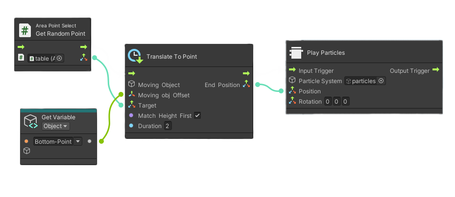
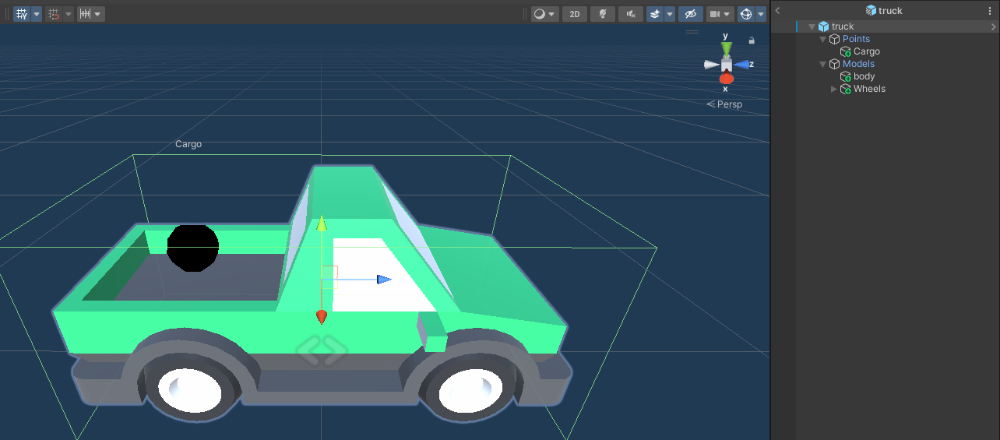
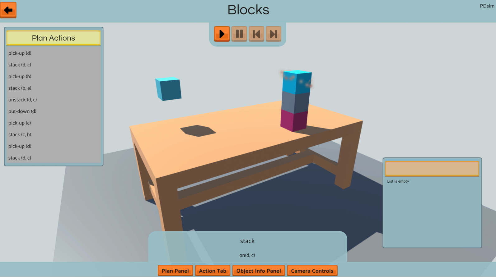
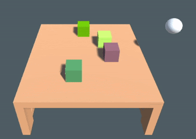

# PDSim: Planning Domain Simulation
Visualization and animation of PDDL plans.

Use PDDL domain and problem files to setup a simulation.

# Installation: Back-End
PDSim use a back-end server to generate the Unity's components used for the simulation, install it from [here](https://github.com/Cryoscopic-E/PDSim-Backend)

# Project

- PDDL `predicates` are used to define animation in Unity using the built-in visual scripting language.

- PDDL `types` is defined are use to create objects prefab of a particular category. Import all the models you want to repesent PDDL types.

- PDDL `actions' effects and init` are the main animated component. Interact with the UI to get info about the state of the environment and each component with the built-in UI



Example with Blocks World:




## Documentation
Check the wiki here:

## Acknowledgement
PDSim is being developed for the AIPlan4EU H2020 project (https://aiplan4eu-project.eu)

[@aiplan4eu](https://github.com/aiplan4eu) for the [Unified Planning Library](https://github.com/aiplan4eu/unified-planning)

## Publication
If you are using PDSim in your work please cite it:
```
@inproceedings{de2022plan,
  title={What Plan? Virtual Plan Visualization with PDSim},
  author={De Pellegrin, Emanuele and Petrick, Ronald PA},
  booktitle={32nd International Conference on Automated Planning and Scheduling 2022},
  year={2022}
}
```
